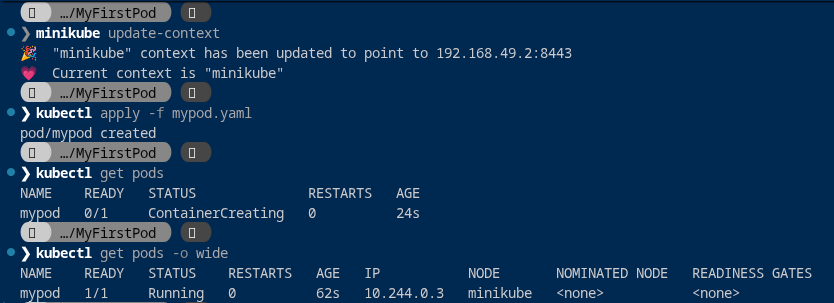
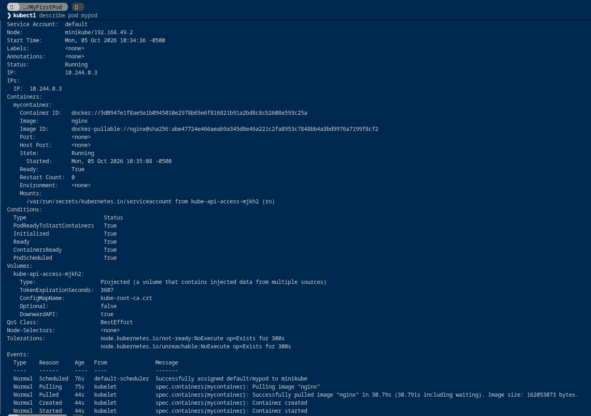
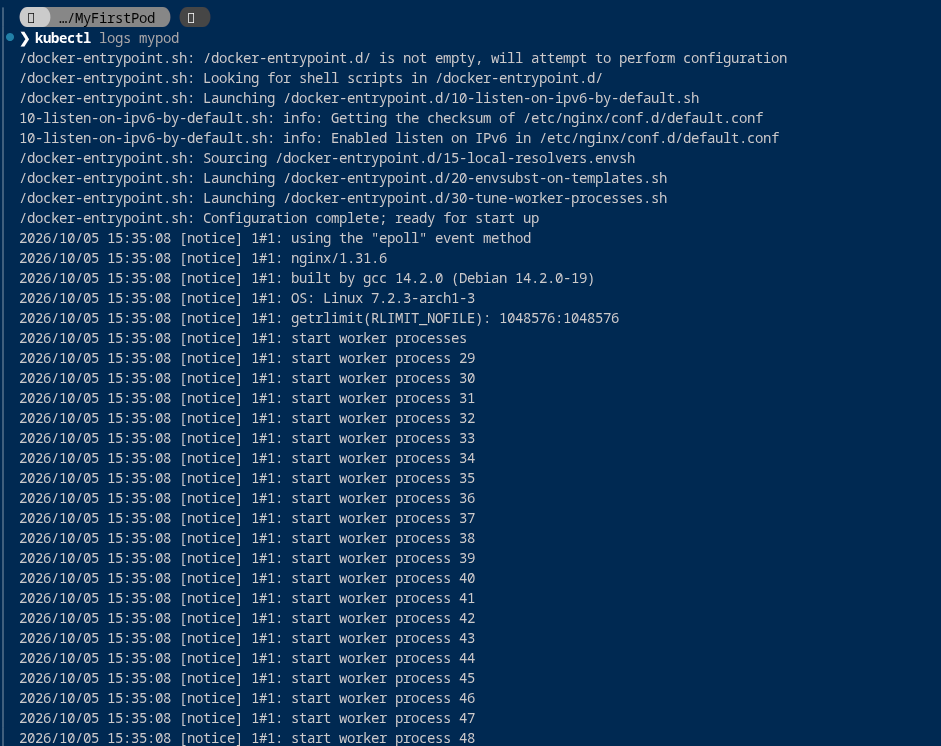
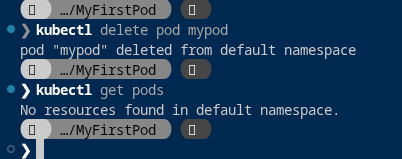

# Hands-On Lab: Deploying, Inspecting, and Managing Your First Pod

## 1. Overview and Lab Objectives

This laboratory guides you through the complete lifecycle of deploying, inspecting, troubleshooting, and deleting a standalone Pod in a local Minikube cluster.

By completing this hands-on guide, you will learn to:
* Synchronize the `kubectl` context to your active Minikube instance.
* Deploy a containerized workload using both declarative manifests (`kubectl apply`) and imperative commands (`kubectl run`).
* Track Pod lifecycle progression from `ContainerCreating` to `Running`.
* Interpret deep diagnostic metrics using `kubectl describe`.
* Inspect container stdout/stderr output using `kubectl logs`.
* Execute commands inside running containers with `kubectl exec`.
* Gracefully terminate workloads with `kubectl delete`.
* Diagnose and solve common production complications (`ImagePullBackOff`, `CrashLoopBackOff`, and internal network isolation).

---

## 2. Laboratory Manifest (`mypod.yaml`)

Ensure the file `mypod.yaml` is located in your working directory:

```yaml
apiVersion: v1
kind: Pod
metadata:
  name: mypod
spec:
  containers:
    - name: mycontainer
      image: nginx
```

---

## 3. Step-by-Step Execution Walkthrough

### Step 1: Context Synchronization and Pod Deployment

Before dispatching commands to the cluster, verify that your local context is pointing to the Minikube API server endpoint:

```bash
minikube update-context
```

Deploy the workload using the declarative manifest:

```bash
kubectl apply -f mypod.yaml
```

Monitor the deployment progress:

```bash
kubectl get pods
kubectl get pods -o wide
```

#### Terminal Execution Screenshot



#### Output Analysis

1. **Context Update:**
   ```text
   "minikube" context has been updated to point to 192.168.49.2:8443
   Current context is "minikube"
   ```
   Ensures API requests target the virtual machine / container running Minikube (`192.168.49.2`).

2. **Creation Confirmation:**
   ```text
   pod/mypod created
   ```
   The API server accepted the manifest, saved it in `etcd`, and handed scheduling to the `kube-scheduler`.

3. **Status Transitions:**
   * **Initial Query (`24s`):**
     ```text
     NAME    READY   STATUS             RESTARTS   AGE
     mypod   0/1     ContainerCreating  0          24s
     ```
     `0/1` indicates that 0 out of 1 defined containers are ready. The status `ContainerCreating` shows the worker node (`minikube`) is pulling the `nginx` image over the internet and preparing container namespaces.
   * **Subsequent Query with `-o wide` (`62s`):**
     ```text
     NAME    READY   STATUS    RESTARTS   AGE   IP          NODE       NOMINATED NODE   READINESS GATES
     mypod   1/1     Running   0          62s   10.244.0.3  minikube   <none>           <none>
     ```
     * `READY 1/1`: All containers initialized successfully.
     * `STATUS Running`: The NGINX process is active.
     * `IP 10.244.0.3`: The internal IP assigned to the Pod within the Kubernetes virtual overlay network.
     * `NODE minikube`: The specific cluster node executing the container.

---

### Step 2: In-Depth Pod Inspection (`kubectl describe`)

When a Pod exhibits issues, `kubectl get` provides insufficient detail. `kubectl describe` exposes real-time state, health checks, controller bindings, and chronological cluster events:

```bash
kubectl describe pod mypod
```

#### Terminal Execution Screenshot



#### Key Sections Decoded

1. **Host and IP Identification:**
   * `Node: minikube/192.168.49.2`: The host system running the `kubelet`.
   * `IP: 10.244.0.3`: Internal cluster IP address.
2. **Container State & Runtime IDs:**
   * `Container ID: docker://5d0947e...`: The low-level Docker container ID running inside the Minikube environment.
   * `Image: nginx` and `Image ID: docker-pullable://nginx@sha256:...`: Verified cryptographic digest of the pulled image.
   * `State: Running`: Process uptime and start timestamp.
3. **Mounted Projections:**
   * `Mounts: /var/run/secrets/kubernetes.io/serviceaccount`: Kubernetes automatically projects an API authentication token, namespace certificate, and CA into every Pod to facilitate optional communication with the Kubernetes API.
4. **Conditions:**
   * `PodReadyToStartContainers: True`
   * `Initialized: True`
   * `Ready: True`
   * `ContainersReady: True`
   * `PodScheduled: True`
5. **Chronological Events Timeline:**
   At the bottom of the output, the event stream chronicles the exact progression:
   * `Scheduled`: Default scheduler successfully assigned `default/mypod` to node `minikube`.
   * `Pulling`: Kubelet initiated the pull for image `"nginx"`.
   * `Pulled`: Successfully downloaded image in 30.79 seconds (size: ~162 MB).
   * `Created`: Container instantiated.
   * `Started`: Main process launched.

---

### Step 3: Inspecting Container Logs (`kubectl logs`)

To inspect standard output (`stdout`) and standard error (`stderr`) streams emitted by the containerized application:

```bash
kubectl logs mypod
```

#### Terminal Execution Screenshot



#### Output Analysis

The logs show the initialization sequence executed by the official NGINX container entrypoint:
* `/docker-entrypoint.sh`: Verifies `/docker-entrypoint.d/` shell configuration scripts.
* `10-listen-on-ipv6-by-default.sh`: Configures default IPv6 listeners in `/etc/nginx/conf.d/default.conf`.
* `20-envsubst-on-templates.sh`: Evaluates any environment variable substitutions.
* `30-tune-worker-processes.sh`: Optimizes process worker threads to match available CPU cores.
* `Configuration complete; ready for start up`: The primary `nginx/1.31.6` master process boots and forks worker processes.

#### Additional Logging Commands
```bash
# Follow logs in real-time (streaming output)
kubectl logs -f mypod

# Inspect logs of a previously crashed container instance
kubectl logs -p mypod
```

---

### Step 4: Executing Commands Inside the Pod (`kubectl exec`)

You can execute arbitrary commands inside a running container without needing SSH servers installed in your image:

```bash
# Run a single non-interactive command
kubectl exec mypod -- nginx -v
kubectl exec mypod -- cat /etc/nginx/nginx.conf

# Open an interactive shell session (sh or bash)
kubectl exec -it mypod -- /bin/sh
```

Inside the shell, verify that the local web server is responding:

```bash
curl http://localhost:80
exit
```

---

### Step 5: Deleting and Tearing Down the Workload

When the laboratory exercise is complete, cleanly remove the Pod:

```bash
kubectl delete pod mypod
```

Verify that the resource has been purged from the cluster:

```bash
kubectl get pods
```

#### Terminal Execution Screenshot



#### Output Analysis

1. `pod "mypod" deleted from default namespace`:
   Kubernetes sends a `SIGTERM` signal to the container, initiating a graceful shutdown period (default: 30 seconds). If the container does not exit before the deadline, a `SIGKILL` is issued.
2. `No resources found in default namespace`:
   Confirms the Pod was completely removed from the cluster node and unindexed from `etcd`.

Alternatively, deletion can be performed using the manifest file directly:

```bash
kubectl delete -f mypod.yaml
```

---

## 4. Imperative vs. Declarative Approaches

In this exercise, you created the Pod using:

```bash
# Declarative Approach (Recommended)
kubectl apply -f mypod.yaml
```

Kubernetes also supports the **imperative** approach:

```bash
# Imperative Approach (One-liner)
kubectl run mypod --image=nginx
```

| Criterion | Declarative (`kubectl apply -f`) | Imperative (`kubectl run`) |
| :--- | :--- | :--- |
| **Persistence** | Manifest stored in version control (Git). | Command history only; changes are ephemeral. |
| **Auditability** | Full code review and diffs possible. | Hard to track in team environments. |
| **Complexity** | Supports complex configurations (volumes, probes, limits). | Limited to parameters accepted as command-line flags. |
| **Recommended Use** | Production systems, CI/CD pipelines, GitOps. | Rapid ad-hoc testing and debugging. |

---

## 5. Potential Complications and Troubleshooting Guide

When running Pods in Kubernetes, various real-world complications frequently occur:

### Complication 1: `ImagePullBackOff` or `ErrImagePull`
* **Symptoms:** Pod status shows `ImagePullBackOff` or `ErrImagePull`.
* **Causes:**
  * Typo in the image name (e.g., `image: ngnix` instead of `image: nginx`).
  * Image tag does not exist in the registry.
  * Image resides in a private repository without configured `imagePullSecrets`.
  * Node lacks internet connectivity to Docker Hub / registry.
* **Diagnosis:**
  ```bash
  kubectl describe pod mypod
  ```
  Inspect the `Events` section for HTTP 404 or authentication failure messages.
* **Fix:** Correct the image string in `mypod.yaml` and re-apply:
  ```bash
  kubectl apply -f mypod.yaml
  ```

### Complication 2: `CrashLoopBackOff`
* **Symptoms:** Pod status transitions rapidly between `Running`, `Error`, and `CrashLoopBackOff`, with the `RESTARTS` counter incrementing continuously.
* **Causes:**
  * The container process completed or crashed immediately upon launching. For instance, launching a base image like `ubuntu:latest` without a long-running foreground command causes the container to exit with code 0 or 1, triggering Kubernetes to restart it in an escalating back-off delay.
  * Application configuration syntax errors or uncaught exceptions during startup.
* **Diagnosis:**
  ```bash
  kubectl logs mypod --previous
  ```
* **Fix:** Provide a persistent foreground entrypoint or fix application errors before redeploying.

### Complication 3: Pod Remains Stuck in `Pending`
* **Symptoms:** Pod remains in `Pending` status indefinitely and never reaches `Running`.
* **Causes:**
  * The cluster node lacks sufficient allocatable CPU or RAM to satisfy the Pod's `resources.requests`.
  * Node taints prevent the Pod from being scheduled (missing tolerations).
* **Diagnosis:**
  ```bash
  kubectl describe pod mypod
  ```
  Look for scheduler events like: `0/1 nodes are available: 1 Insufficient cpu`.
* **Fix:** Adjust resource requests in the manifest or increase Minikube hardware allocations:
  ```bash
  minikube stop
  minikube start --memory=4096m --cpus=4
  ```

### Complication 4: Cannot Access the Web Server from Host Browser
* **Symptoms:** Pod is `Running` at `10.244.0.3`, but accessing `http://10.244.0.3` from your local workstation browser fails or times out.
* **Cause:** The Pod IP (`10.244.0.3`) belongs to the internal Kubernetes virtual overlay network, which is isolated from your host workstation's routing table.
* **Fix:** Use `kubectl port-forward` to establish a secure TCP tunnel between your workstation and the Pod:
  ```bash
  kubectl port-forward pod/mypod 8080:80
  ```
  Open `http://localhost:8080` in your host browser to view the NGINX welcome page.

### Complication 5: Modifying Immutable Fields
* **Symptoms:** Running `kubectl apply -f mypod.yaml` fails with `The Pod "mypod" is invalid: spec: Forbidden: pod updates may not change fields other than...`
* **Cause:** Kubernetes Pod specifications are largely immutable once created.
* **Fix:** Delete the existing Pod and create the updated version:
  ```bash
  kubectl delete pod mypod --wait=false
  kubectl apply -f mypod.yaml
  ```
